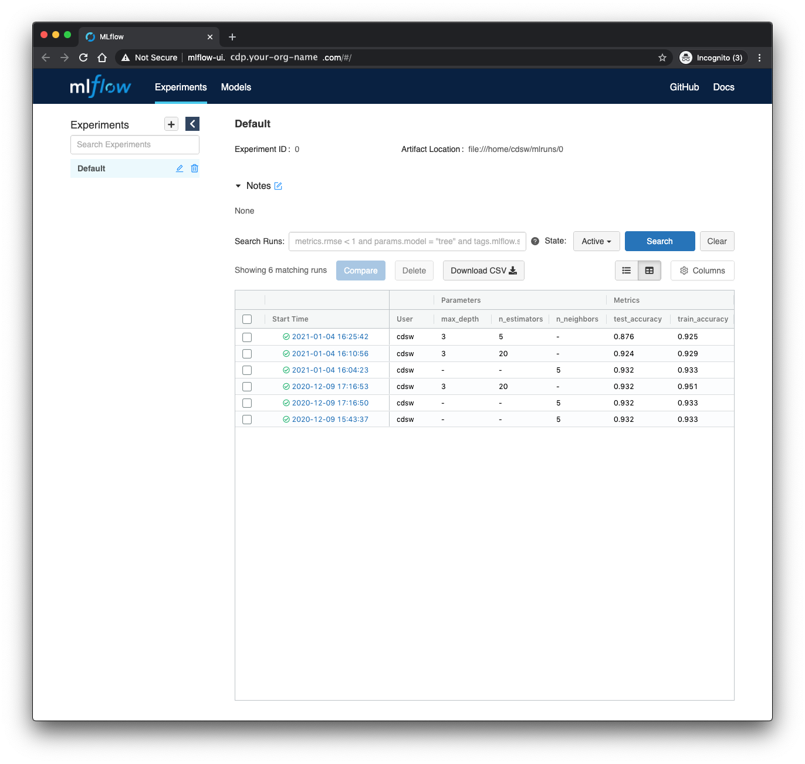

# MLflow for experiment tracking

[MLflow](https://www.mlflow.org/) self describes as

> an open source platform to manage the ML lifecycle, including experimentation, reproducibility, deployment, and a central model registry.

In particular MLflow's experiment tracking capabilities offer a low-friction way of tracking model hyperparameters and metrics across many experiments.
This repository demonstrates the use of MLflow tracking in a couple of simple machine learning model training scripts inside Cloudera Machine Learning (CML) and Cloudera Data Science Workbench (CDSW).
(We will refer only to CML in the remainder of this README, but the code should function equally well in either CML or CDSW).
The repository is intended as less a tutorial on MLflow, and more an example of running MLflow inside CML.

The rest of this README is structured as follows.

- [Repository structure](#repository-structure).
  A brief orientation to the structure of this repository.
- [Running training scripts](#running-training-scripts).
  Instructions and setup for running model training and testing, logging experimental results with MLflow.
- [Viewing the MLflow UI](#viewing-the-mlflow-ui).
  Using the MLflow UI to view the training logs.

## Repository structure

The folder structure of this repo is as follows

```
.
├── cml       # This folder contains scripts that facilitate the project launch on CML
└── scripts   # Our analysis code
```

When the training scripts have been run (this will happen on project launch if using the CML Applied ML Prototype interface), an additional `mlruns` directory will appear for use by MLflow.
This can be redirected to another location (HDFS, for instance)

### cml

These scripts are specific to Cloudera Machine Learning, and, with the `.project-metadata.yaml` file in the root directory, allow the project to be deployed automatically, following a declarative specification for jobs, model endpoints and applications.

```
cml
├── install_dependencies.py # Script to run pip install of Python dependencies
└── mlflow_ui.py            # Script to launch MLflow ui application.
```

### scripts

This is where all our analysis code lives.
In a more involved analysis, we could replace these scripts with jupyter notebooks to run manually, or abstract some re-usable code into a Python libary.

```
scripts
├── data.py                 # create fake train and test data
├── train_kneighbors.py     # train a k-nearest neighbors classifier
└── train_random_forest.py  # train a random forest classifier
```

There are three ways to launch this project on CML:

1. **From Prototype Catalog** - Navigate to the Prototype Catalog on a CML workspace, select the "MLflow Tracking" tile, click "Launch as Project", click "Configure Project"
2. **As ML Prototype** - In a CML workspace, click "New Project", add a Project Name, select "ML Prototype" as the Initial Setup option, copy in the [repo URL](https://github.com/cloudera/CML_AMP_MLflow_Tracking.git), click "Create Project", click "Configure Project"
3. **Manual Setup** - In a CML workspace, click "New Project", add a Project Name, select "Git" as the Initial Setup option, copy in the [repo URL](https://github.com/cloudera/CML_AMP_MLflow_Tracking.git), click "Create Project". Launch a Python3 Workbench Session with at least 2GB of memory and 1vCPU. Then follow the instructions below, in order.

## Running training scripts

If this repo is imported as an Applied Machine Learning Prototype in CML, the launch process should handle all the setup for you, and you can skip the Installation step.
In case you want to run through it manually, follow the instructions in the Installation section below.

### Installation

The code was developed against Python 3.6.9, and will likely work on more later versions.
Inside a CML Python 3 session, simply run

```
!pip3 install -r requirements.txt
```

In order for Python to pick up the `scripts` directory when running from the command line (see below), we must set an environment variable for the project, setting the `PYTHONPATH` to the root directory of the project.
Unless you have specifically cloned the project into a different location, this will be `/home/cdsw`.
See the [instructions for setting project-level environment variables in CML](https://docs.cloudera.com/machine-learning/cloud/engines/topics/ml-environment-variables.html).
Alternately, type `export PYTHONPATH=/home/cdsw` in a session terminal.


### Training

Inside the `scripts/` directory are three scripts, as described above.
The `data.py` script creates a fake dataset for a supervised classification problem.
When working with genuine business data, we'd probably be reading this data from a database or flat file storage.

There are two training scripts.

- `train_kneighbors.py` trains a k-nearest neighbors algorithm, where the number of neighbors to consider is provided as a command line argument.
- `train_random_forest.py` trains a random forest, and we expose two hyperparameters&mdash;the maximum tree depth and number of trees&mdash;as command line arguments.

Each script is instrumented with MLflow to log the hyperparameters used and the accuracy of the trained model on a train and test set.

To train the k-nearest neighbors model, start a CML session and run `!python3 scripts/train_kneighbors.py` in the session Python prompt, or without the bang (`!`) in the session terminal.
This will train the model with the default (5) nearest neighbors.
To run with a different number of neighbors, pass a command line argument like so:

```bash
!python3 scripts/train_kneighbors.py --n-neighbors 3
```

If the code was imported as an Applied Machine Learning Prototype, the declarative project will have set up a job for each training script, and executed each once, using the default hyperparameters.
Feel free to run the scripts some additional times, passing different hyperparameters.
This can be done in any of three ways:

1. By re-running the jobs after changing the default hyperparameter values in the script.
2. Interactively in a Python session.
3. At the command line in a session terminal, as described above.

## Viewing the MLflow UI

Since our training scripts were instrumented with MLflow, the parameters, metrics, models and additional metadata associated with any training runs will have been logged in the `mlruns` directory.
We can investigate the performance metrics for each run using MLflow's UI.
The automated setup will have created a CML Application called "MLflow UI" that can be visited from the Applications tab of CML, and will look something like this.



We can now interact with the MLfLow UI as if it were running on our local machine to compare model training runs.

You can start the MLflow UI manually inside a session with

```bash
!mlflow ui --port $CDSW_READONLY_PORT
```

The UI will be listed in the nine-dot menu in the upper right corner of the session interface.
Clicking it will open a new browser tab with the UI.
When launched in a session, the UI will block other uses of the session, and will be closed when the session closes.
It's not recommended to run two simultaneous copies of the MLflow interface (i.e. both as an Application and inside a session).
